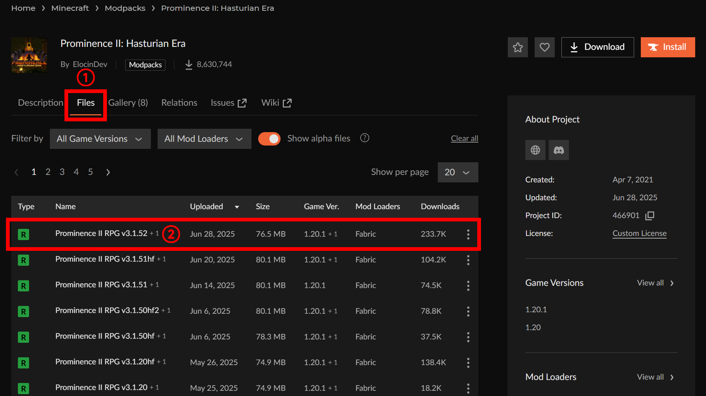

# 如何下载整合包的服务端文件

## CurseForge整合包

以下使用卓越2作为演示，其他在CurseForge发布的整合包类似

一、打开整合包页面（卓越2为https://www.curseforge.com/minecraft/modpacks/prominence-2-rpg/）

二、打开整合包页面的Files页面，选择你想开服的整合包版本

三、打开你选择的版本页面，点击Additional Files，点击下面的Server Pack，然后点击Download按钮

## FTB整合包

以下使用FTB OceanBlock 2作为演示，其他在FTB官网发布的整合包类似

一、打开整合包页面（FTB OceanBlock 2为https://www.feed-the-beast.com/modpacks/128-ftb-oceanblock-2）

二、打开整合包页面的Versions页面，在Select Version栏选择你想开服的整合包版本

三、在Server Files处下载服务端文件

